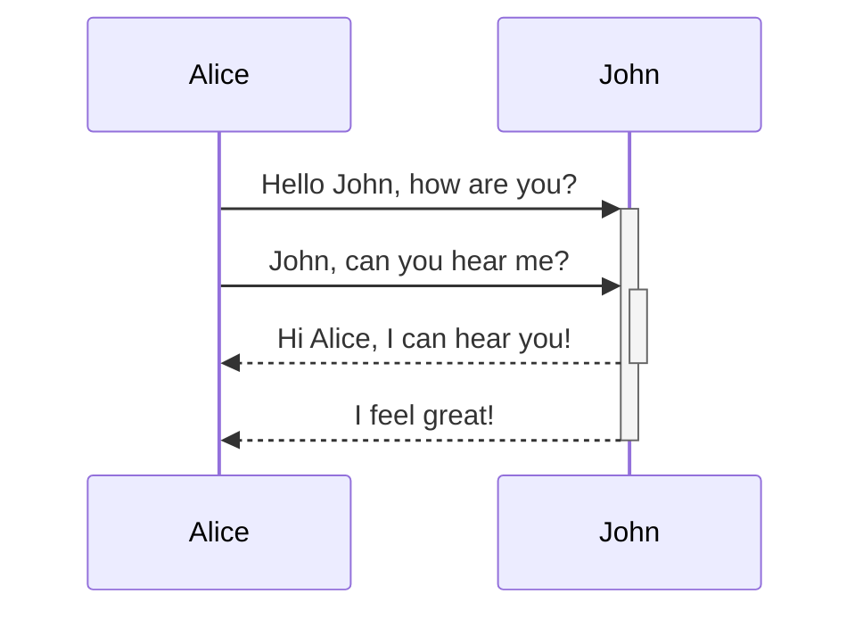

https://help.obsidian.md/Editing+and+formatting/Callouts

```Markdown
> [!info]
> Here's a callout block.
> It supports **Markdown**, [[Internal link|Wikilinks]], and [[Embed files|embeds]]!
```

> [!info]
> Here's a callout block.
> It supports **Markdown**, [[Internal link|Wikilinks]], and [[Embed files|embeds]]!

# Collapsible

Just add a `-` at after the [...] tag

> [!faq]- Are callouts foldable?
> Yes! In a foldable callout, the contents are hidden when the callout is collapsed.

# **Nested callouts**

> [!question] Can callouts be nested?
> > [!todo] Yes!, they can.
> > > [!example]  You can even use multiple layers of nesting.

# Most types

> [!example]
> Lorem ipsum dolor sit amet

> [!bug]
> Lorem ipsum dolor sit amet

> [!danger]
> Lorem ipsum dolor sit amet

> [!danger]
> Lorem ipsum dolor sit amet

> [!warning]
> Lorem ipsum dolor sit amet

> [!success]
> Lorem ipsum dolor sit amet

> [!tip]
> Lorem ipsum dolor sit amet

> [!abstract]
> Lorem ipsum dolor sit amet

> [!note]
> Lorem ipsum dolor sit amet

> [!info]
> Lorem ipsum dolor sit amet

> [!question]
> Lorem ipsum dolor sit amet

> [!todo]
> Lorem ipsum dolor sit amet

> [!quote]
> Lorem ipsum dolor sit amet

# Custom callouts

Exemple CSS snippet, to add to Obsidian global CSS snippets directory 
```css
.callout[data-callout="custom-question-type"] {
    --callout-color: 255, 0, 0;
    --callout-icon: lucide-alert-circle;
}
```

> [!custom-question-type]- My custom callout
> Access the css snippets folder in the "Appearance" section in Obsidian global settings.


